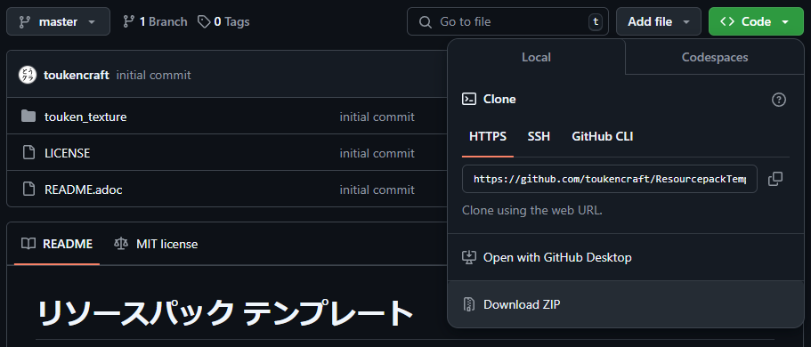
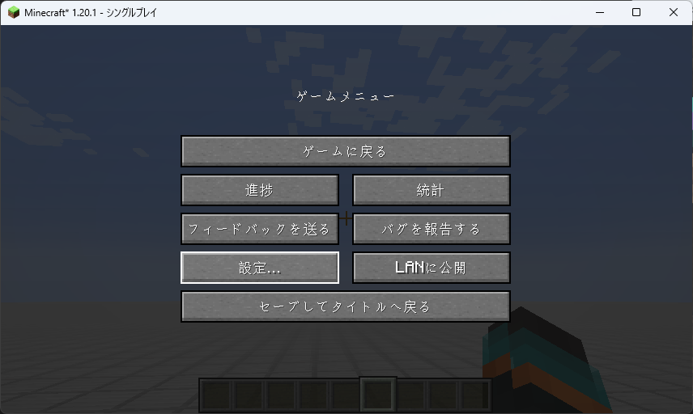

= リソースパック テンプレート
:icons: font
:figure-caption: 図

image:https://img.shields.io/badge/Minecraft_Version-1.20.1-green[]
image:https://img.shields.io/badge/ResourcePack_Format-15-blue[]

刀剣クラフト用のリソースパックです。
このテンプレートには刀剣と刀剣男士のテクスチャが含まれています。
必要に応じてテクスチャを置き換えてください。

== リソースパックの作成方法

[start=0]
. 刀剣男士に使用したいプレイヤースキン(ワイド)のテクスチャを用意

. image:https://img.shields.io/badge/-<> Code ▼-238636[] {gt} image:https://img.shields.io/badge/-Download ZIP-gray[] を押してテンプレートをダウンロード
+
.ダウンロードボタンの場所

. ``touken_texture``内のテクスチャを用意したテクスチャに置き換え

. ``touken_texture``内のファイルをZIP形式で圧縮
+
WARNING: 解凍したときフォルダが二重にならないように、フォルダの中身を選択して圧縮してください。
+
.圧縮するときに選択するファイル

. 必要に応じてZIPファイルの名前を変更
+
NOTE: 導入時にこのZIPファイルの名称が表示されます。

== リソースパックの導入方法

. Minecraftのタイトルやゲームメニューから``設定...``を開く
+

+

. 設定画面から``リソースパック...``を選択
+

. 画面左下の``パックフォルダーを開く``を選択
+

. ``resourcepacks``フォルダーが開かれるので、ZIPファイルを入れる

. 作成したZIPファイルの▶️ボタンを押す
+
WARNING: ZIPファイルが一覧に表示されない場合、フォルダが二重に圧縮されていないか等を確認してください。
+

. ZIPファイルが選択中に移れば完了
+

